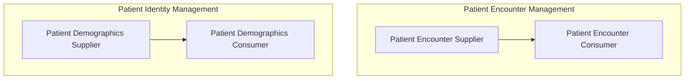
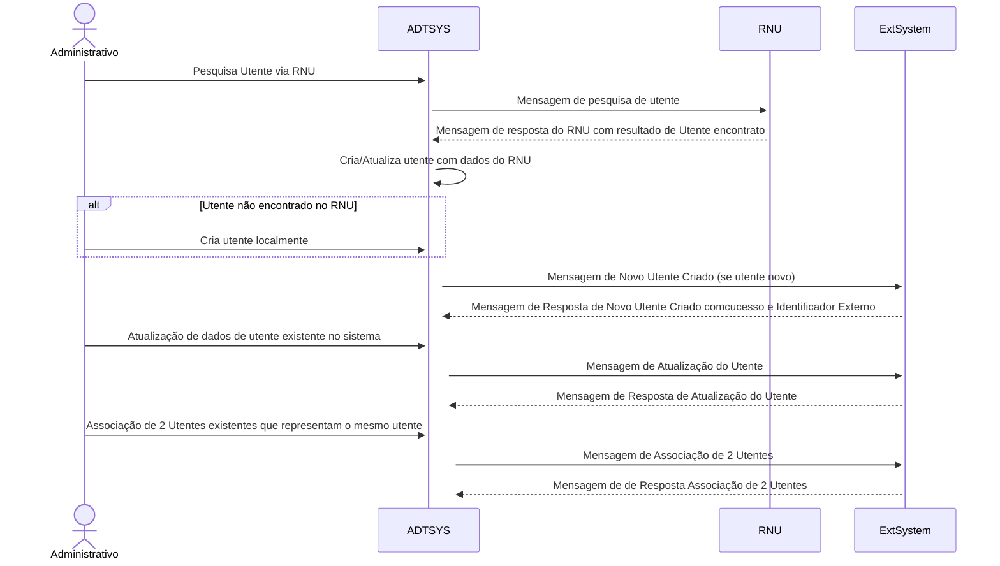
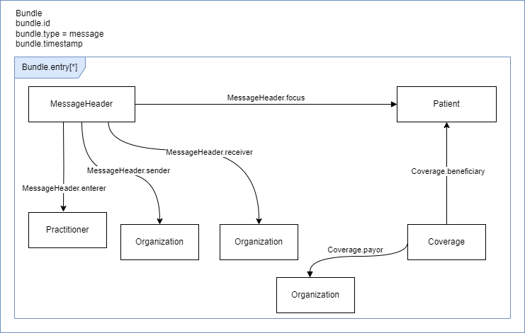
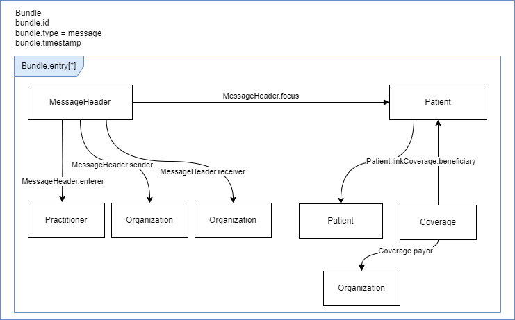
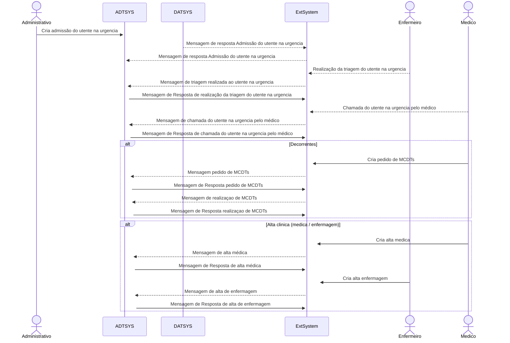
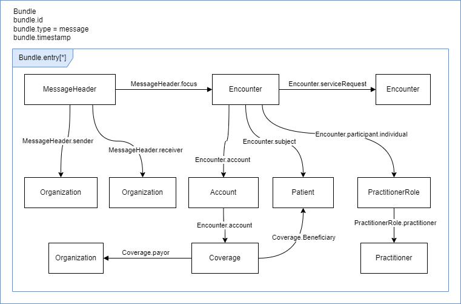

# Âmbito
O objetivo deste Guia de Implementação é especificar como representar o Perfil de Gestão de Administração de Pacientes, definindo operações baseadas em trocas de massagens FHIR para a gestão da identidade do paciente e informações das interações do utente com as unidades de prestação de cuidados de saúde. 

Estes contextos podem ser representados pelos seguintes dois casos de uso de acordo com o IHE [PAM Profile](http://profiles.ihe.net/ITI/TF/Volume1/ch-14.html).

Os sistemas ADT apresentam duas grandes funcões: Gestão da Identidade do Utente e Gestão das Interações do Utente com as Unidades de Saúde, e atuam como um _Patient Demographic Supplier_ e um _Patient Encounter Supplier_.

## Gestão da Identidade do Utente
Esta seção corresponde à operação “Gestão de Identidade do Utente” da Estrutura Técnica de Infraestrutura de TI do IHE. Esta transação é usada pelos atores Patient Demographics Supplier e Patient Demographics Consumer.

O termo “dados demográficos do paciente” refere-se aos dados de identificação e identidade completa do paciente e também às informações sobre pessoas relacionadas com ele, como cuidador principal, médico de família, tutor, familiares mais próximos, etc.

Esta transação transmite dados demográficos do paciente no domínio de identificação do utente e contém eventos para criação, atualização, fusão, associaçao e desassociação de utentes. A transação pode ser usada nos vários contextos como internamento, e aqueles que recebem um leito na unidade de saude, ou urgência, consulta externa, hospital de dia e ambulatorio e outros que não têm atribuído um leito na unidade de saúde.

### Caso de Uso
O José Silva sentiu-se mal e decidiu dirigir-se ao Hospital X para ser atendida por médico.

O funcionário administrativo do secretariado da Urgencia inicia o processo de criação de um novo utente para o José Silva, com base nas limitadas informações por ele fornecidas. Nesta fase, apenas estão disponíveis detalhes básicos sobre José Silva; sua data de nascimento. O endereço da residencia e número de telefone da residencia são desconhecidos. Utilizando o aplicativo de registo, o funcionário cria a identidade inicial do utente José Silva, e o sistema ADT garante que uma mensagem de Criação do Utente seja enviada para todas as aplicações que necessitam de ter cenhecimento do novo utente, com as informações pessoais disponíveis.

Mais tarde nesse dia, são disponibilizadas informações pessoais mais detalhadas sobre o José Silva. O administrativo atualiza o registo de identidade da paciente no sistema ADT e este envia uma mensagem de Atualização do Paciente para refletir esses novos detalhes nos sistemas que necessitam destas informações.

Uma semana depois, o funcionário recebe um pedido do Centro de Imagiologia para criar um perfil temporário de um paciente para José Manuel Santos Silva. Seguindo procedimentos padrão, o funcionário insere os dados no pedido de registo, com as informações disponiveis da identidade de  José Manuel Santos Silva. Após nova reconciliação, o funcionário atualiza os dados demográficos de José Manuel Santos Silva com o número nacional de utente para completar os dados de identificação do utente.

Durante uma auditoria de rotina, o funcionário descobre que os dois perfis José Silva e José Manuel Santos Silva representam a mesma pessoa. Para resolver esta duplicação de registos, o funcionário associa a segunda identidade à identidade de José Silva criada anteriormente no sistema. Uma mensagem de associação de utentes é então comunicada a todas as aplicações anteriores, garantindo que todos os registos estejam atualizados e consistentes.

### Diagrama de fluxo de Dados

Em Portugal, um utente pode ser criado através da obtenção dos dados demográficos no Registo Nacional de Utentes (RNU), ou inserindo os dados disponíveis, fornecidos pelo paciente ou seu representante, diretamente no sistema, caso não seja possível pesquisar o utente ou o utente não exista no RNU, ou pode ser ainda criado um Utente Não Identificado (registo temporário) caso não seja possível saber quem é o utente em questão. A partir destes cenários podemos ter três tipos possíveis de identificação de utentes:

- Utente validado pelo RNU -> ESte utente possui os seguintes dados de identificação Numero Nacional de Utente (NNU), ou Numero de Identificação Fiscal (NIF), Cartão de cidadão ou Passaporte. Ainda É possivel ser validado por Nome e Data de Nascimento mas não é garantido que os resultados retornem o utente em causa. O utente é pesquisado no RNU e é retoenado um resultado com sucesso. O utente é criado automaticamente com os dados retornados pelo RNU.

- Utente não validável pelo RNU -> A pesquisa do RNU não devolve resultados para o utilizador pesquisado, sendo necessário criá-lo no sistema sem os dados validados centralmente pelo RNU, com os dados de identificação disponíveis.

- Utente não identificado -> Não há identificação do utente sendo criado um utente não identificado com os dados possíveis para associar esse utente criado no sistema ao utente que receberá atendimento clínico, para que posteriormente possa ser feita a identificação e associá-lo ao utente correto.

#### Criação de um utente e Atualização de dados do Utente
No sistema de _Messaging_ todas as mensagens devem ser produzidas de acordo com as regras de comunicação por mensagem Fhir, encapsulando num bundle do tipo "mensagem" todos os resursos necessários, devendo o recurso _MessageHeader_ ser o primeiro do _bundle.entry_.

- [x] MessageHeader.eventCoding  (_Disponibilizar valuset dos códigos dos eventos_ e a relação com os eventos do HL7 V2.x)
  - Para uma mensagem PATIENT_NEW é esperada uma resposta PATIENT_NEW_RESPONSE
  - Para uma mensagem PATIENT_UPDATE é esperada uma resposta PATIENT_UPDATE_RESPONSE
  - Para as mensagems de resposta é obrigatorio o envio do elemento MessageHeader.response

- [x] Coverage (Planos/Seguros de saúde associados ao Utente com referencia à Entidade Responsavel)

#### Associação de utentes

- [x] MessageHeader.eventCoding  (_Disponibilizar a relação com o evento do HL7 V2.x)
    - Para uma mensagem PATIENT_LINK é esperada uma resposta PATIENT_LINK_RESPONSE

## Gestão de Interações do Utente com a Entidade Prestadora de Cuidados de Saúde
Esta seção corresponde à operação “Gestão de Interações do Utente com a Entidade de Prestação de Cuidados de Saúde” (_Patient Encounter Management_) da Estrutura Técnica de Infraestrutura de TI do IHE. Esta transação é usada pelos atores _Patient Encounters Supplier_ e _Patient Encounters Consumer_.

O termo “Interações do Utente com a Entidade de Prestação de Cuidados de Saúde” refere-se a todas interaçãoes do utente com a entidade prestadora de cuidados de saúde e a todas as informações relevantes relacionadas com essa interação como tipo de interaçao, admissão, triagem, transferencias, altas, mdcts, entidades responsaveis, etc.

### Diagrama de fluxo de Dados no contxto da Urgencia

#### Criação de uma admissão à Urgência 
Uma admissão à urgencia pode ter origen numa referenciação (SNS24, CSP, INEM) que prepara a admissão do utente mesmo antes do utente chegar ao hospital, ou diretamente no secretariado do serviço do Urgencia se o utente se dirigiu pelos pr´pprios meios sem contactar sem o SNS24 nem os CSP.

- [x] MessageHeader.eventCoding  (_Disponibilizar a relação com o evento do HL7 V2.x)
  - Para uma mensagem EMERGENCY_ADMISSION é esperada uma resposta EMERGENCY_ADMISSION_RESPONSE
