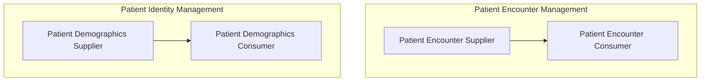
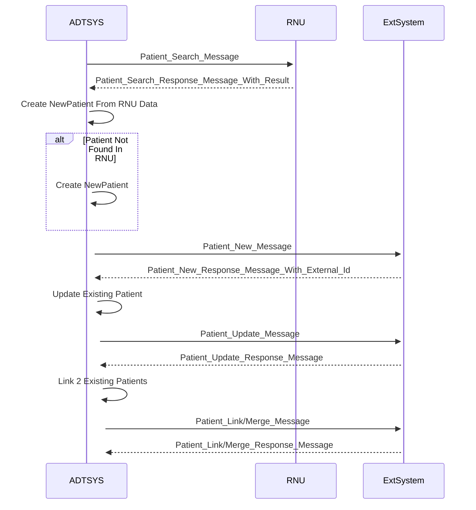

# Scope
The goal of this Implementation Guide is to specify how to represent the Patient Administration Management Profile defining transactions based on FHIR massage exchanges to support patient identity and encounter information, as well as movements within a healthcare facility encounter.
This can be represented by the following two use cases in accordance to IHE [PAM Profile](http://profiles.ihe.net/ITI/TF/Volume1/ch-14.html).

ADT System provides two main functions: Patient Identity Management and Patient Encounter Management and will act as a _Patient Demographic Supplier_ and a _Patient Encounter Supplier_.

## Patient Identity Management
This section corresponds to transaction “Patient Identity Management” of the IHE IT Infrastructure Technical Framework. This 
transaction is used by the actors Patient Demographics Supplier and Patient Demographics Consumer.

The term “patient demographics” is intended to convey the patient identification and full identity and also information on 
persons related to this patient, such as primary caregiver, family doctor, guarantor, next of kin. 

This transaction transmits patient demographics in a patient identification domain and contains events for creating, updating,
merging, linking and unlinking patients. The transaction can be used in acute care settings for both inpatients (i.e., those who are assigned a bed at the facility) and outpatients (i.e., those who are not assigned a bed at the facility) 
and can also be used in a pure ambulatory environment.

### Use case
Maria Silva felt unwell and decided to go to Hospital HCH for medical attention. 

The administrative staff member of the Patient Registration department begins the process of creating a new patient profile for Maria Silva, based on limited information provided by her. At this stage, only basic details about Maria Silva are available; her date of birth, home address, and home phone number are unknown. Using the registration application, the staff member creates Maria Silva's initial patient identity and ensures a Patient Creation message is sent to all downstream applications with the available personal information.

The following day, more detailed personal information about Maria Silva becomes available. The staff member updates her patient identity record in the registration application and sends out a Patient Update message to reflect these new details.

A week later, the staff member receives a request from Imaging Center Moon to create a temporary patient profile for Maria José Silva. Following standard procedures, the staff member inputs the information into the registration application, creating Maria José Silva's identity. Upon further reconciliation, the staff member updates Maria José Silva's demographics with the healthcare national number to complete the full identification data of the patient.

During a routine audit, the staff member discovers that the two profiles for Maria Silva represent the same individual. To resolve this, the staff member merges the second identity with the initially established identity of Maria Silva in the system. A Patient Merge message is then communicated to all downstream applications, ensuring all records are up-to-date and consistent.

### Workflow diagram

#### Patient Creation

In Portugal, a user can be created getting patient demographic data from the National User Register (RNU), or inserting data available, provided by patient or its representative, directly in the system if it is not possible to search for the user or the user does not exist in the RNU, or yet a Non Identified User can be created (temporary registration) if it is not possible to know who the user in question is. From these scenarios we can have three possible types of patient identification:

User validated by RNU -> The user is searched in RNU and a successful result is returned. The user is created automatically with the data returned by RNU. In this process the user has a valid NNU.

Non-validatable user -> The RNU search does not return results for the searched user, and it is necessary to create it in the system without the data centrally validated by the RNU, with the identification data available.

Unidentified user -> There is no identification of the user and an unidentified user is created with the data possible to associate this user created in the system with the user who will receive clinical care, so that identification can later be made and associate it with the correct user.

