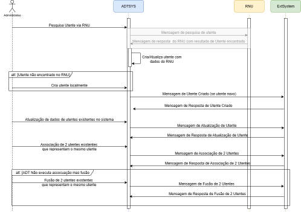

Conforme descrito na introdução deste IG, os sistemas ADT apresentam duas grandes funcões: Gestão da Identidade do Utente e Gestão das Interações do Utente com as Unidades de Saúde. O ambito deste IG é focado na gestão da identidade do utente.

### Caso de Uso
O Joaquim Silva sentiu-se mal e decidiu dirigir-se ao Hospital X para ser atendido por médico.

O funcionário administrativo do secretariado da Urgencia inicia o processo de criação de um novo utente para o Joaquim Silva, com base nas limitadas informações por ele fornecidas. Nesta fase, apenas estão disponíveis detalhes básicos sobre José Silva; sua data de nascimento. O endereço da residencia e número de telefone da residencia são desconhecidos. Utilizando o aplicativo de registo, o funcionário cria a identidade inicial do utente José Silva, e o sistema ADT garante que uma mensagem de Criação do Utente seja enviada para todas as aplicações que necessitam de ter cenhecimento do novo utente, com as informações pessoais disponíveis.

Mais tarde nesse dia, são disponibilizadas informações pessoais mais detalhadas sobre o José Silva. O administrativo atualiza o registo de identidade da paciente no sistema ADT e este envia uma mensagem de Atualização do Paciente para refletir esses novos detalhes nos sistemas que necessitam destas informações.

Uma semana depois, o funcionário recebe um pedido do Centro de Imagiologia para criar um perfil temporário de um paciente para Joaquim Manuel Santos Silva. Seguindo procedimentos padrão, o funcionário insere os dados no pedido de registo, com as informações disponiveis da identidade de  José Manuel Santos Silva. Após nova reconciliação, o funcionário atualiza os dados demográficos de José Manuel Santos Silva com o número nacional de utente para completar os dados de identificação do utente.

Durante uma auditoria de rotina, o funcionário descobre que os dois registos de utente José Silva e José Manuel Santos Silva representam a mesma pessoa. Para resolver esta duplicação de registos, o funcionário associa a segunda identidade à identidade de José Silva criada anteriormente no sistema. Uma mensagem de associação de utentes é então comunicada a todas as aplicações anteriores, garantindo que todos os registos estejam atualizados e consistentes.

### Workflow de processos

O **Diagrama de Sequência** seguinte ilustra as interaçoes entre o sistema ADT e sistemas terceiros:

 

O fluxo representado tem em conta que os dados do utente poderão ser validados pelo serviço do Registo Nacional do Utente (RNU) e que essa é a fonte de verdade de dados do utente, e prevê que quando não é possivel encontrar ou validar o utente via RNU o administrativo tem que criar o utente localmente no sistema ADT.
Do ponto de vista do sustema ADT o utente pode ser classificado em 3 categorias:

- Utente validável pelo RNU -> O utente possui NNU ou atributos que permitem validar o utente via RNU e quando é pesquisado no RNU é retornado resultado com sucesso. Os dados devolvidos pelo RNU permitem que os dados do utente sejam atualizados no sistema ADT. No entanto, se a pesquisa falha fica temporariamente não validado, mas mantém a condição de validável.

- Utente não validável -> O utente não possui NNU, ou os atributos existentes não permitem validar o utente via RNU.

- Utente não identificado -> Não existe identificação do utente que permita validar via RNU.

### Eventos desencadeados na Gestão de Identidade do Utente

As ações representadas no fluxo da gestão de identidade do utente são:
- criação do utente
- atualização de dados do utente
- fusão/associação do utente

Adicionalmente podem ser necessárias ações de pesquisa baseado no perfil IHE [[PDQ] Patient Demographics Query](https://wiki.ihe.net/index.php/Patient_Demographics_Query):
- pesquisa de utente
- pesquisa de dados demográficos do utente

Seguindo o perfil “Gestão de Identidade do Utente” da Estrutura Técnica de Infraestrutura de TI do IHE, proposmos uma correspondencia entre as mensagens HL7v2.x e mensagens FHIR correspondentes sendo necessário para tal defenir um sistema de codificação de eventos para FHIR.

## Estrutura das mensagens FHIR

Estando perante o paradigma de mensagens, de forma genérica, os recursos necessários à comunicação dos dados dos utentes são os representados no diagrama abaixo, e devem ser encapsulados num bundle que deve seguir as regras da arquitetura de *Messaging*. As mensagems Fhir geradas para estes eventos são sempre composta por um *bundle type="message"*, que vai agregar todos os recursos necessários, sendo obrigatório que o primeiro recurso da lista de recursos (*bundle.entry*) seja o recurso *MessageHeader*:

O bundle tem como entradas os Recursos:
- MessageHeader (Obrigatório ser o primeiro recurso do elemento *entry* do *bunle*)
- Patient (Recurso principal da mensagem)
- Coverage *
- Organization *
- Practitioner *

#### Criação de um utente e Atualização de dados do Utente

- [x] MessageHeader.eventCoding  (_Disponibilizar valuset dos códigos dos eventos_ e a relação com os eventos do HL7 V2.x)
  - Para uma mensagem PATIENT_NEW é esperada uma resposta PATIENT_NEW_RESPONSE
  - Para uma mensagem PATIENT_UPDATE é esperada uma resposta PATIENT_UPDATE_RESPONSE
  - Para as mensagems de resposta é obrigatorio o envio do elemento MessageHeader.response

- [x] Coverage (Planos/Seguros de saúde associados ao Utente com referencia à Entidade Responsavel)

#### Associação de utentes / Fusão de sutentes

Para associação de utentes
- [x] MessageHeader.eventCoding  (_Disponibilizar a relação com o evento do HL7 V2.x)
    - Para uma mensagem PATIENT_LINK é esperada uma resposta PATIENT_LINK_RESPONSE

Para fusão de utentes
- [x] MessageHeader.eventCoding  (_Disponibilizar a relação com o evento do HL7 V2.x)
  - Para uma mensagem PATIENT_MERGE é esperada uma resposta PATIENT_MERGE_RESPONSE

### Eventos a comunicar nas mensagens

| Event                                             | Mensagem^Trigger  | Evento Fhir             |
|---------------------------------------------------|-------------------|-------------------------|
| Criação de novo utente                            | ADT^A28           | PATIENT_NEW             |
| Resposta da criação novo utente                   | ADT^A08 / ADT^A31 | PATIENT_NEW_RESPONSE    |
| Atualização de dados do utente                    | ADT^A08 / ADT^A31 | PATIENT_UPDATE          |
| Resposta da atualização de dados do utente        | ACK^A08 / ACK^A31 | PATIENT_UPDATE_RESPONSE |
| Associação de utentes                             | ADT^A24           | PATIENT_LINK            |
| Resposta da associação de utentes                 | ACK^A24           | PATIENT_LINK_RESPONSE   |
| Fusão de utentes                                  | ADT^A40           | PATIENT_MERGE           |
| Resposta da fusão de utentes                      | ACK^A40           | PATIENT_MERGE_RESPONSE  |
| Pesquisa de utente                                | QBP^Q22           | PATIENT_SEARCH          |
| Resposta da pesquisa de utente                    | RSP^K22           | PATIENT_SEARCH_RESPONSE |
| Pesquisa de dados demograficos do utente          | QRY^A19           | PATIENT_SEARCH          |
| Resposta pesquisa de dados demograficos do utente | ADR^A19           | PATIENT_SEARCH_RESPONSE |

Os eventos aqui apresentados têm igualmente em conta o standard HL7 v2.x e a documentação publica de especificação da SPMS, que está implementada em grande parte das instituições de prestação de cuidados de Saúde em particular nos Cuidados de Saúde Hospitalares.
