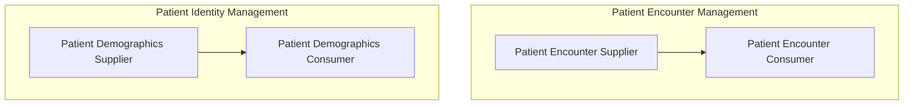

# Scope
The goal of this Implementation Guide is to specify how to represent the Patient Administration Management Profile defining transactions based on FHIR massage exchanges to support patient identity and encounter information, as well as movements within a healthcare facility encounter.
This can be represented by the following two use cases in accordance to IHE [PAM Profile](http://profiles.ihe.net/ITI/TF/Volume1/ch-14.html).

ADT System provides two main functions: Patient Identity Management and Patient Encounter Management and will act as a _Patient Demographic Supplier_ and a _Patient Encounter Supplier_.

## Patient Identity Management
This section corresponds to transaction “Patient Identity Management” of the IHE IT Infrastructure Technical Framework. This 
transaction is used by the actors Patient Demographics Supplier and Patient Demographics Consumer.

The term “patient demographics” is intended to convey the patient identification and full identity and also information on 
persons related to this patient, such as primary caregiver, family doctor, guarantor, next of kin. 

This transaction transmits patient demographics in a patient identification domain and contains events for creating, updating,
merging, linking and unlinking patients. The transaction can be used in acute care settings for both inpatients (i.e., those who are assigned a bed at the facility) and outpatients (i.e., those who are not assigned a bed at the facility) 
and can also be used in a pure ambulatory environment.

