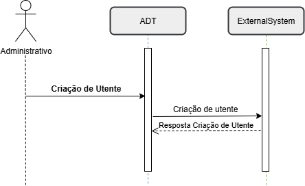
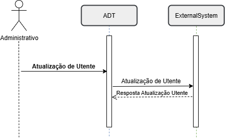
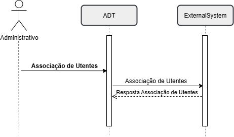
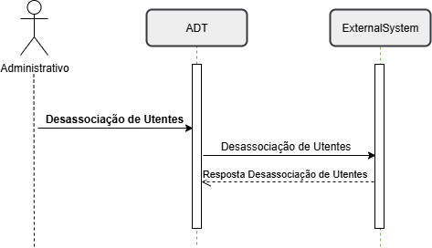

### Introdução
#### O que é um Utente?
No sistema de saúde português, utente é o termo utilizado para designar qualquer pessoa que utiliza os serviços do Serviço Nacional de Saúde (SNS). Em outras palavras, é o equivalente a “paciente” ou “beneficiário” em outros contextos como o sistema de saúde privado, mas com um sentido mais amplo, já que inclui qualquer cidadão que recorra aos cuidados de saúde, independentemente de estar doente ou não.
Assim, o utente é uma pessoa que recebe ou necessita de cuidados e está sob os cuidados de um sistema ou profissional de saúde, seja por prevenção de doenças e manutenção da saúde até o diagnóstico, tratamento e acompanhamento de condições agudas ou crónicas.

Um utente é qualquer pessoa que necessita ou recebe cuidados de saúde, abrangendo desde ações de prevenção e promoção da saúde até ao diagnóstico, tratamento e acompanhamento de condições agudas ou crónicas, incluindo os indivíduos que procuram ativamente atendimento, como aqueles integrados em programas de vigilância ou prevenção.

Os utentes são o elemento central dos sistemas de saúde, podendo interagir com estes em diferentes contextos, como consultas de rotina, episódios de urgência, internamentos, entre outros. A relação entre utente e profissional de saúde deve basear-se na confiança, ética e adaptação dos cuidados às necessidades individuais.
No contexto digital, a identidade do utente é representada por dados demográficos e clínicos, organizados e partilhados entre sistemas, com o objetivo de melhorar a qualidade, segurança e eficiência dos cuidados prestados.

No _standard_ FHIR, o recurso _Patient_ representa digitalmente o conceito de utente, permitindo a interoperabilidade de dados entre diferentes sistemas de informação e organizações. Este recurso inclui:

- Dados básicos, como nome, data de nascimento, género e informações de contacto.

- Identificadores únicos, como números de registo hospitalar ou o Número Nacional de Utente (NNU).

- Informações adicionais opcionais, como estado civil, preferências linguísticas ou contactos de emergência.

- Informação de natureza financeira, como condição face ao SNS, sub-sistemas de saúde associados, caracterização de situação económica

Este recurso é essencial para garantir que os dados de saúde sejam corretamente associados à pessoa certa, promovendo segurança e continuidade do cuidado. Recomenda-se a utilização do Número Nacional do Utente (NNU) como identificador oficial. No entanto cada implementação tem a capacidade de definir o identificador oficial na troca de informações

- O NNU deve ser utilizado como identificador oficial no recurso Patient e registado como identifier com use = official.

- Identificadores internos como identifier com use = usual (e. g. numero sequencial do SONHO).

- Identificadores temporários podem ser registados como use = temp e substituídos assim que o NNU estiver disponível.

A ligação entre o utente e os episódios de saúde é fundamental para a administrativa e gestão clínica, sendo o utente é o ponto de origem de todos os episódios.

Os episódios de saúde estruturam e documentam as interações clínicas e administrativas, oferecendo uma visão longitudinal e integrada do histórico do indivíduo e possibilitando cuidados centrados na pessoa.

Enquanto o recurso Patient foca os dados pessoais e demográficos do utente, o conceito de episódio de saúde organiza e contextualiza as interações específicas desse utente com o sistema de saúde.

Em Portugal, a gestão administrativa dos dados dos utentes é assegurada pelo [Registo Nacional de Utentes](https://www.spms.min-saude.pt/2015/10/rnu) (RNU), tendo a missão de atuar como um MPI (_Master Patient Index_) para os aspetos administrativos / de identificação dos utentes.

O RNU tem como principal objetivo garantir que cada cidadão possui um identificador único (NNU), assegurando uma identificação consistente e inequívoca em todas as instituições de saúde.
 Este registo centraliza e normaliza os dados administrativos, facilitando a interoperabilidade entre sistemas de informação hospitalar (HIS) e outras unidades de saúde.

O NNU é essencial para ligar episódios clínicos e administrativos de diferentes organizações, promovendo continuidade e qualidade no cuidado ao utente.tes sistemas de informação hospitalar (HIS) e unidades de saúde. Este identificador nacional é fundamental para ligar episódios clínicos e administrativos de diferentes organizações de saúde, promovendo continuidade e qualidade nos cuidados.

No entanto, se o utente não está registado no RNU ou se não tem informação suficiente para validar o seu registo no RNU, o sistema ADT tem que proceder ao registo e manutenção dos dados desses utentes no sistema local, e mais tarde sendo possivel proceder à sincronização de dados com o RNU. 

Outro cenário possível, é o registo de utentes não identificados no sistema ADT, que ocorre quando não é possivel identificar utentes que dão entrada no hospital sem condições de se proceder à sua identificação. Este é um cenário particular da Urgencia Hospitalar.

## Casos de Uso 

### Criação de Utente
O Administrativo cria um registo de um novo utente no sistema que pode ser por via RNU ou localmente no sistema ADT. Esta ação desencadeia uma mensagem de ceriação de novo utente para o sistema externo. O sistema externo deve enviar uma resposta ao sistema ADT com o resultado do processamento aplicacional da mensagem, e com a identificação dos erros se não for processada com sucesso.
 
 

### Atualização de dados do Utente
O Administrativo atualiza o registo de um utente existente no sistema. Esta atualização pode ser desencadeada por sincronização de dados com o RNU ou localmente no sistema ADT. Esta ação desencadeia uma mensagem de atualização de dados do utente para o sistema externo. O sistema externo deve enviar uma resposta ao sistema ADT com o resultado do processamento aplicacional da mensagem. O sistema externo deve enviar uma resposta ao sistema ADT com o resultado do processamento aplicacional da mensagem, e com a identificação dos erros se não for processada com sucesso.

 

 

### Fusão de identificação de Utentes
O Administrativo identifica 2 registos no sistema que pertencem o mesmo utente e procede à ação de fusão dos 2 registos num só. Esta ação desencadeia uma mensagem de fusão de utentes para o sistema externo. O sistema externo deve enviar uma resposta ao sistema ADT com o resultado do processamento aplicacional da mensagem. O sistema externo deve enviar uma resposta ao sistema ADT com o resultado do processamento aplicacional da mensagem, e com a identificação dos erros se não for processada com sucesso.

 

 

### Associação de identificação Utentes
O Administrativo identifica 2 registos no sistema que pertencem o mesmo utente e procede à ação de _linkagem_ dos 2 registos. Esta ação desencadeia uma mensagem de associação de utentes para o sistema externo. O sistema externo deve enviar uma resposta ao sistema ADT com o resultado do processamento aplicacional da mensagem, e com a identificação dos erros se não for processada com sucesso.

 

 

### Desassociação de identificação Utentes
O Administrativo identifica que 2 registos foram erradamente associados no sistema e procede à ação de desassociação dos 2 registos. Esta ação desencadeia uma mensagem de desassociação de utentes para o sistema externo. O sistema externo deve enviar uma resposta ao sistema ADT com o resultado do processamento aplicacional da mensagem, e com a identificação dos erros se não for processada com sucesso.

 

 

